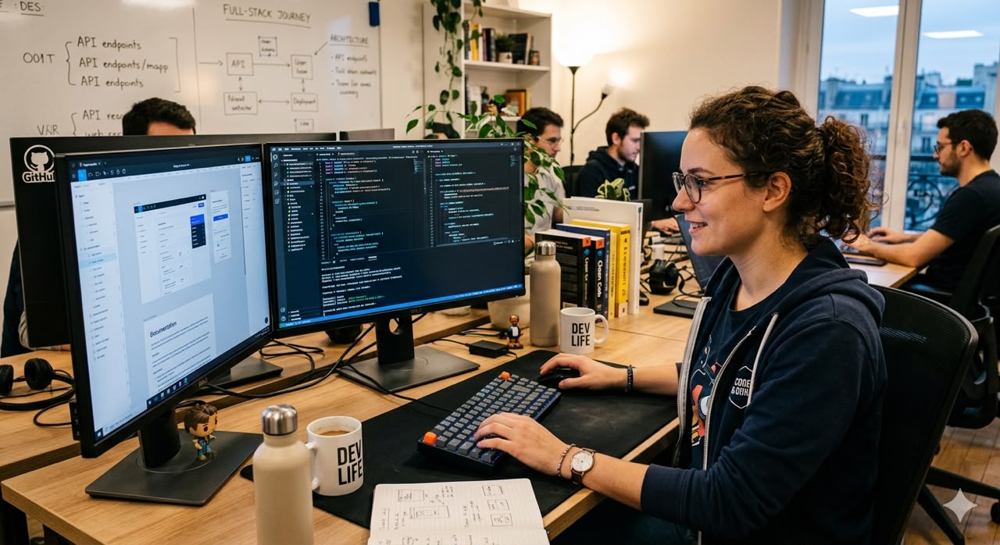

<!DOCTYPE html>
<html lang="fr">

<head>

  <meta charset="UTF-8">

  <meta name="viewport" content="width=device-width, initial-scale=1.0">

  <title>AfriTalent</title>

  <!-- Bootstrap CSS -->
  <link href="https://cdn.jsdelivr.net/npm/bootstrap@5.3.3/dist/css/bootstrap.min.css" rel="stylesheet">

  <!-- Bootstrap Icons -->
  <link rel="stylesheet" href="https://cdn.jsdelivr.net/npm/bootstrap-icons@1.11.3/font/bootstrap-icons.min.css">

  <!-- Google Fonts -->
  <link href="https://fonts.googleapis.com/css2?family=Poppins:wght@300;400;500;600;700&display=swap" rel="stylesheet">

  <!-- CSS -->
  <link rel="stylesheet" href="css/style.css">

</head>

<body>

  <!-- NAVBAR -->

  <nav class="navbar navbar-expand-lg navbar-dark bg-dark fixed-top" id="mainNavbar">

    

      <!-- Logo -->

      

      <!-- Nom -->

      <a class="navbar-brand fw-bold" href="index.html">
        AfriTalent
      </a>

      <!-- Bouton mobile -->

      <button
        class="navbar-toggler"
        type="button"
        data-bs-toggle="collapse"
        data-bs-target="#menu"
      >

        

      </button>

      <!-- Menu -->

      

        <ul class="navbar-nav ms-auto">

          <li class="nav-item">
            <a class="nav-link active" href="index.html">
              Accueil
            </a>
          </li>

          <li class="nav-item">
            <a class="nav-link" href="#freelances">
              Freelances
            </a>
          </li>

          <li class="nav-item">
            <a class="nav-link" href="about.html">
              À propos
            </a>
          </li>

          <li class="nav-item">
            <a class="nav-link" href="#blog">
              Blog
            </a>
          </li>

          <li class="nav-item">
            <a class="nav-link" href="tarifs.html">
              Tarifs
            </a>
          </li>

          <li class="nav-item">
            <a class="nav-link" href="contact.html">
              Contact
            </a>
          </li>

        </ul>

        <!-- Bouton -->

        <a href="#contact" class="btn btn-warning ms-3">
          Rejoindre AfriTalent
        </a>

      

    

  </nav>

  <!-- HERO -->

  <section id="accueil" class="bg-dark text-white text-center py-5 mt-5">

    

      <h1 class="display-4 fw-bold mt-5">
        La plateforme des talents freelances africains
      </h1>

      <h2 class="mt-4 fs-5 fw-normal">
        Des talents africains qualifiés pour vos projets digitaux, accessibles en quelques clics.
      </h2>

      

        <a href="#freelences" class="btn btn-primary btn-lg m-2">
          Je suis Freelance
        </a>

        <a href="#contact" class="btn btn-light btn-lg m-2">
          Je cherche un Freelence
        </a>

      

      <!-- Image -->

      

        

      

    

  </section>

  <!-- STATISTIQUES -->

  <section class="py-5">

    

      

        

          

            <h2 class="text-primary fw-bold">
              0
            </h2>

            

              Freelances
            

          

        

        

          

            <h2 class="text-primary fw-bold">
              0+
            </h2>

            

              Entreprises
            

          

        

        

          

            <h2 class="text-primary fw-bold">
              0+
            </h2>

            

              Missions réalisées
            

          

        

      

    

  </section>

  <!-- COMMENT ÇA MARCHE -->

  <section id="freelances" class="bg-light py-5">

    

      <h2 class="text-center fw-bold mb-5">
        Comment ça marche ?
      </h2>

      

        

          1
          <i class="bi bi-person-plus-fill fs-1 text-primary"></i>
          <h4 class="mt-3">
            Créer un compte
          </h4>
          

            Inscrivez-vous gratuitement et créez votre profil en quelques minutes.
          

        

        

          2
          <i class="bi bi-search fs-1 text-primary"></i>
          <h4 class="mt-3"Trouver un projet>
            Trouver un projet
          </h4>
          

               Explorez des missions adaptées à vos compétences.
           

        

        

          3
          <i class="bi bi-chat-dots-fill fs-1 text-primary"></i>
          <h4 class="mt-3">
            Collaborer
          </h4>
          

            Travaillez avec des entreprises sérieuses partout en Afrique.
          

        

        

          4
          <i class="bi bi-cash-coin fs-1 text-primary"></i>
          <h4 class="mt-3">
            Être payé
          </h4>
          

            Recevez vos paiements rapidement et en toute sécurité.
          

        

      

    

  </section>

  <!-- CATÉGORIES -->

  <section class="py-5">

    

      <h2 class="text-center fw-bold mb-5">
        Catégories services
      </h2>

      

        

          

            <i class="bi bi-code-slash fs-1 text-primary"></i>
            <h4 class="mt-3">
              Développement Web
            </h4>
            

              320 freelences disponibles
            

          

        

        

          

            <i class="bi bi-palette-fill fs-1 text-primary"></i>
            <h4 class="mt-3">
              Design UI/UX
            </h4>
            

              210 freelences disponibles
            

          

        

        

          

            <i class="bi bi-megaphone-fill fs-1 text-primary"></i>
            <h4 class="mt-3">
              Marketing Digital
            </h4>
            

              180 freelences disponibles
            

          

        

        

          

            <i class="bi bi-cpu-fill fs-1 text-primary"></i>
            <h4 class="mt-3">
              Data & IA
            </h4>
            

              140 freelences disponibles
            

          

        

        

          

            <i class="bi bi-pencil-square fs-1 text-primary"></i>
            <h4 class="mt-3">
              Rédaction Tech
            </h4>
            

              95 freelences disponibles
            

          

        

        

          

            <i class="bi bi-cloud-fill fs-1 text-primary"></i>
            <h4 class="mt-3">
              DevOps & Cloud
            </h4>
            

              75 freelences disponibles
            

          

        

      

    

  </section>

  <!-- TÉMOIGNAGES -->

  <section class="bg-light py-5">

    

      

        <h2 class="fw-bold">
          Témoignages
        </h2>

      

      

        

          <!-- Témoignage 1 -->

          

            

              

              <h4 class="mt-3">
                Alpha diop
              </h4>

              

                Freelance Développeur
              

              

                "AfriTalent m'a permis de trouver mes premiers clients internationaux."
              

              

                <i class="bi bi-star-fill"></i>
                <i class="bi bi-star-fill"></i>
                <i class="bi bi-star-fill"></i>
                <i class="bi bi-star-fill"></i>
                <i class="bi bi-star-fill"></i>

              

            

          

          <!-- Témoignage 2 -->

          

            

              

              <h4 class="mt-3">
                moussa tine
              </h4>

              

                Designer UI/UX
              

              

                "Une plateforme moderne et simple pour travailler avec des entreprises sérieuses."
              

              

                <i class="bi bi-star-fill"></i>
                <i class="bi bi-star-fill"></i>
                <i class="bi bi-star-fill"></i>
                <i class="bi bi-star-fill"></i>
                <i class="bi bi-star-fill"></i>

              

            

          

          <!-- Témoignage 3 -->

          

            

              

              <h4 class="mt-3">
                bintou diouf
              </h4>

              

                Développeuse Fullstack
              

              

                "AfriTalent m'a offert de belles opportunités en tant que développeuse."
              

              

                <i class="bi bi-star-fill"></i>
                <i class="bi bi-star-fill"></i>
                <i class="bi bi-star-fill"></i>
                <i class="bi bi-star-fill"></i>
                <i class="bi bi-star-fill"></i>

              

            

          

        

        <!-- Boutons -->

        <button
          class="carousel-control-prev"
          type="button"
          data-bs-target="#carouselExample"
          data-bs-slide="prev"
        >

          

        </button>

        <button
          class="carousel-control-next"
          type="button"
          data-bs-target="#carouselExample"
          data-bs-slide="next"
        >

          

        </button>

      

    

  </section>

  <!-- CTA -->

  <section class="cta-section text-white text-center py-5">

    

    

      <h2 class="fw-bold">
        Prêt à lancer votre carrière freelance ?
      </h2>

      

        Rejoignez des milliers de talents africains dès aujourd'hui.
      

      <a href="#contact" class="btn btn-light btn-lg mt-3">
        Commencer maintenant
      </a>

    

  </section>

  <!-- CONTACT -->

  <section id="contact" class="py-5">

    

      <h2 class="text-center fw-bold mb-5">
        Contact
      </h2>

      

        

          <input
            type="text"
            class="form-control mb-3"
            placeholder="Votre nom"
          >

          <input
            type="email"
            class="form-control mb-3"
            placeholder="Votre email"
          >

          <textarea
            class="form-control mb-3"
            rows="5"
            placeholder="Votre message"
          ></textarea>

          <button class="btn btn-primary">
            Envoyer
          </button>

        

      

    

  </section>

  <!-- FOOTER -->

  <footer class="bg-dark text-white py-5">

    

      

        <!-- Colonne 1 -->

        

          

            
            <h5 class="fw-bold mb-0">
              AfriTalent
            </h5>
          

          

            Plateforme africaine mettant en relation freelances et entreprises.
          

        

        <!-- Colonne 2 -->

        

          <h5>
            Liens utiles
          </h5>

          <ul class="list-unstyled">

            <li>
              <a href="index.html#accueil" class="text-white text-decoration-none">
                Accueil
              </a>
            </li>

            <li>
              <a href="index.html#freelances" class="text-white text-decoration-none">
                Freelances
              </a>
            </li>

            <li>
              <a href="about.html" class="text-white text-decoration-none">
                À propos
              </a>
            </li>

            <li>
              <a href="tarifs.html" class="text-white text-decoration-none">
                Tarifs
              </a>
            </li>

            <li>
              <a href="blog.html" class="text-white text-decoration-none">
                Blog
              </a>
            </li>

          </ul>

        

        <!-- Colonne 3 -->

        

          <h5>
            Ressources
          </h5>

          <ul class="list-unstyled">

            <li>
              <a href="#" class="text-white text-decoration-none">
                FAQ
              </a>
            </li>

            <li>
              <a href="#" class="text-white text-decoration-none">
                Support
              </a>
            </li>

          </ul>

        

        <!-- Colonne 4 -->

        

          <h5>
            Contact
          </h5>

          

            Email : triomphantpanze@gmail.com
          

          

            Téléphone : +221774723932
          

          <!-- Réseaux -->

          

            <a href="#" class="text-white me-2"><i class="bi bi-facebook"></i></a>
            <a href="#" class="text-white me-2"><i class="bi bi-instagram"></i></a>
            <a href="#" class="text-white me-2"><i class="bi bi-linkedin"></i></a>
            <a href="#" class="text-white"><i class="bi bi-twitter-x"></i></a>

          

        

      

      

      

        

          ©  AfriTalent - Tous droits réservés
        

      

    

  </footer>

  <!-- Bootstrap JS -->

  

  <!-- JS -->

  

</body>

</html>